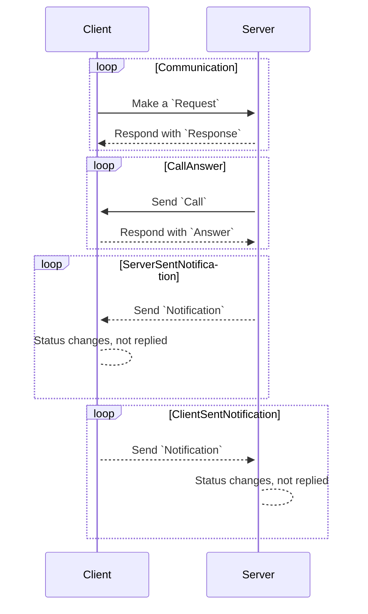

# komcp (WIP)

komcp is Model Context Protocol(MCP) library for Kotlin/Multiplatform.
It provides...

## JSON Schema definition

Built with kotlinx.serialization. Both for server and client. It strictly follows the MCP specification.

## Some wrappers for MCP servers

Not now, but it's planned.

## Some wrappers for MCP clients

It's not planned, but maybe in the future.

## Information

We'll not gonna provide...

- Server libraries, to give you freedom to choose your own server implementation like Express.js, Ktor, etc.
- Client libraries as well as server one, with the same reason as above.
- Kotlin-tic fancy API, because this is intended to be a low-level library for Kotlin/Multiplatform.
- Platform-specific libraries, because... well, this is a multiplatform library.
- Anti-Rickroll mechanism, because I never gonna give you up, never gonna let you down, never gonna run around and
  desert you.

And we might gonna provide...

- `_meta` related features, like progress.

# Note for developers

## Structure

/

- /src/
    - /src/commonMain/: Common code for all platforms. We'll put all of our codebase here, to make it multiplatform.
    - /src/jvmMain/: JVM-specific code. This is for writing simple tests to see which error occurs. Not intended to be
      used in production.
    - /src/jsMain/: Same as above, but for JavaScript.
- /build.gradle.kts: Gradle build script for this project.
- /libs.versions.toml: Gradle version catalog for this project. Use this to manage dependencies, not in
  build.gradle.kts.
- /settings.gradle.kts: Gradle settings script for this project. This is used to include subprojects, if any.
- /README.md: This file, the documentation for this project.
- /LICENSE: The license file for this project. It doesn't exist? Yes, as I haven't decided the license yet. But it will
  be
  open-source, so don't worry about it.
- /proto.json: The JSON schema file for this project. It is
  from [MCP spec](https://modelcontextprotocol.io/specification/2025-06-18/basic#schema).

## Codebase

These instructions should be followed from up to down, to avoid confusion.
<details>
<summary>Example:</summary>
If this is the instruction,

```md
1. Make something
2. Do this
3. Do that
4. Name with `Request` suffix
5. Name with `Response` suffix
```

Then, you should write the code like this:

```kotlin
fun somethingRequestResponse() {
    // Do this
    // Do that
}
```

See? function is ended up with `Response` suffix, since it is the last step of the instruction.
</details>

### JSON-RPC Schema Context

All of dataclasses should be...

- Decorated with `@Serializable` annotation.
- Not decorated with `@Contextual` annotation. Even if specification itself is ambiguous and property
  is `Any` typed, use `@Serializable Any`.
- Not a private, internal, or protected except for sealed classes and serializer object.
- Named with `Request`, `Response`, ..., or `Notification` suffix, if applicable.
- If it is not belonged to `Request`-`Response`-`Notification`... classification model, don't use `Request`,
  `Response`, ..., or `Notification` suffix.
- If it is used by only one dataclass, it can be child of that dataclass. In this case, do not use `Request`,
  `Response`, ..., or `Notification` suffix.
- Named with `Proto` suffix.

Dictionary:

- `Request`: Represents a JSON-RPC request. It is:
    - Communication started by MCP client.
    - Created by MCP client.
    - Sent to MCP server.
- `Response`: Represents a JSON-RPC response. It is:
    - Communication started by MCP client.
    - Created by MCP server.
    - Sent to MCP client, as a reply to the `Request`.
- `Call`: Represents a JSON-RPC request. It is:
    - Communication started by MCP server.
    - Created by MCP server.
    - Sent to MCP client.
- `Answer`: Represents a JSON-RPC response. It is:
    - Communication started by MCP server.
    - Created by MCP client.
    - Sent to MCP server, as a reply to the `Call`.
- `Notification`: Represents a JSON-RPC notification. It is:
    - Communication started by MCP server or MCP client.
    - Created by MCP server or MCP client.
    - Sent to another, without a reply.



## How to build

<details>
<summary>For JS:</summary>
```bash
gradle jsBrowserProductionWebpack
gradle jsBrowserDevelopmentWebpack
```
Result in `build/kotlin-webpack/js/productionExecutable/${rootProject.name}.js` and `build/kotlin-webpack/js/developmentExecutable/${rootProject.name}.js`.
</details>

<details>
<summary>For JVM:</summary>
```bash
gradle jvmFatJar
```
Result in `build/libs/${rootProject.name}-fat.jar`, use with `java -jar build/libs/${rootProject.name}-fat.jar`.
</details>
